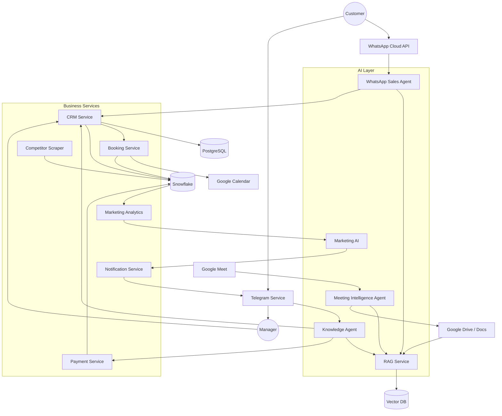

# UML / ARCHITECTURE DIAGRAMS

## 1. UML / Architecture Diagrams

### 1.1. Component Diagram

```mermaid
graph TB
    %% Actors
    Customer((Customer))
    Manager((Manager))

    %% External Services
    WA_Cloud["WhatsApp Cloud API"]
    TG_Service["Telegram Service"]
    G_Meet["Google Meet"]
    G_Drive["Google Drive / Docs"]
    G_Calendar["Google Calendar"]

    %% AI Layer Package
    subgraph AI_Layer["AI Layer"]
        WA_Agent["WhatsApp Sales Agent"]
        TG_Agent["Knowledge Agent"]
        Meet_Agent["Meeting Intelligence Agent"]
        Mkt_AI["Marketing AI"]
        RAG["RAG Service"]
    end

    %% Business Services Package
    subgraph Business_Services["Business Services"]
        CRM["CRM Service"]
        Booking["Booking Service"]
        Payment["Payment Service"]
        Scraper["Competitor Scraper"]
        Mkt_Analytics["Marketing Analytics"]
        Notify["Notification Service"]
    end

    %% Databases
    PG[("PostgreSQL")]
    SF[("Snowflake")]
    VDB[("Vector DB")]

    %% Connections / Flows
    Customer --> WA_Cloud
    WA_Cloud --> WA_Agent
    
    Customer --> TG_Service
    TG_Service --> TG_Agent
    
    G_Meet --> Meet_Agent
    Meet_Agent --> RAG
    
    WA_Agent --> RAG
    TG_Agent --> RAG
    RAG --> VDB
    
    WA_Agent --> CRM
    TG_Agent --> CRM
    
    CRM --> PG
    
    Booking --> G_Calendar
    CRM --> Booking
    Booking --> SF
    
    Payment --> SF
    Scraper --> SF
    
    CRM --> SF
    SF --> Mkt_Analytics
    
    Mkt_Analytics --> Mkt_AI
    Mkt_AI --> Notify
    
    Notify --> TG_Service
    TG_Service --> Manager
    Manager --> CRM
    
    TG_Agent --> Payment
    Meet_Agent --> G_Drive
    G_Drive --> RAG
   
```
