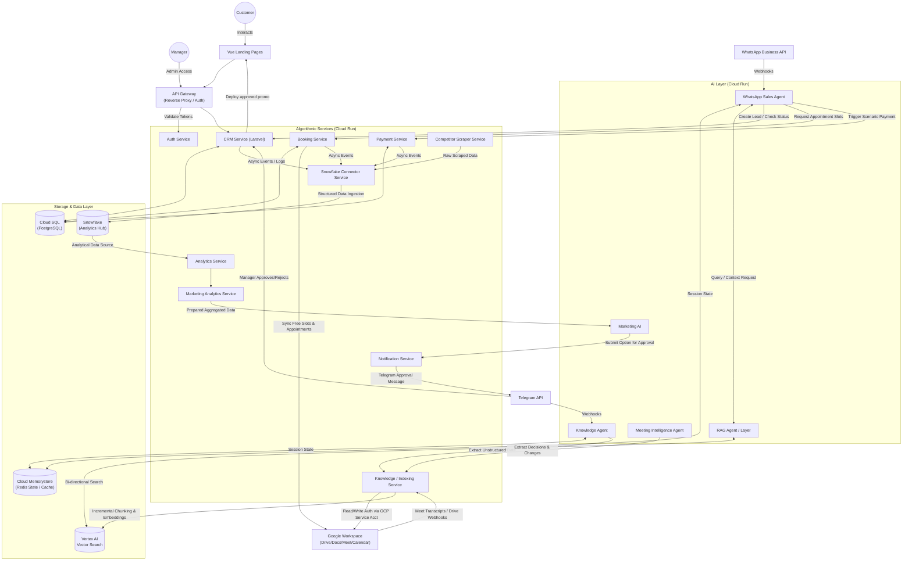
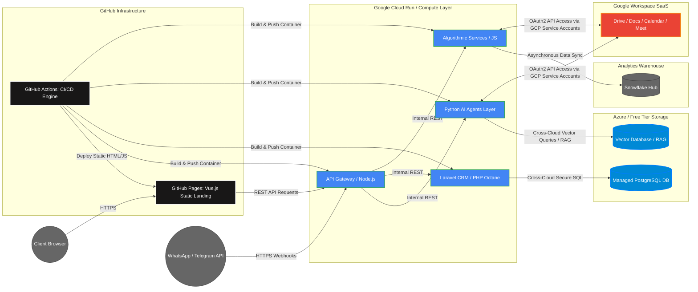

# UML / ARCHITECTURE DIAGRAMS

### 1. Component diagram


### 2. Deployment diagram


### 3. Use case diagram
```mermaid
usecaseDiagram
    %% --- ACTORS (Strictly from Section 4, 10, 11) ---
    actor Customer as "Customer"
    actor Manager as "Manager"

    %% --- REAL EXTERNAL CHANNELS (Section 4) ---
    actor WhatsAppAPI as "WhatsApp Business Cloud API"
    actor TelegramBotAPI as "Telegram Bot API"

    %% --- PLATFORM BOUNDARY ---
    subgraph Platform["AI Multi-Agent Business Automation Platform"]

        %% 3.1. AI Agents: WhatsApp Sales Agent (Section 4.1, 5.1)
        subgraph WhatsAppSalesAgent["Subsystem: services/sales-agent"]
            usecase UC_Determine_Intent as "Determining customer intent"
            usecase UC_RAG_Search as "RAG search of the corporate knowledge base"
            usecase UC_Collect_Data as "Collecting name, phone number, email, company, product of interest, and comments"
            usecase UC_Call_Booking as "Calling the Booking Service"
            usecase UC_Call_Payment as "Calling the Payment Service"
        end

        %% 3.1. AI Agents: Telegram Knowledge Agent & Google Meet Intelligence Agent (Section 5.2, 5.3, 6)
        subgraph KnowledgeMeetAgents["Subsystem: knowledge-&-rag-services"]
            usecase UC_Highlight_Info as "Highlighting useful business information"
            usecase UC_Extract_Meet as "Extracts decisions, tasks, product changes, customer requirements, and agreements"
            usecase UC_Transfer_KS as "Transferring structured data to the Knowledge Service"
            usecase UC_Incremental_Indexing as "Incremental Indexing (Chunking + Embeddings)"
        end

        %% 3.2. Algorithmic Services (Section 7, 8, 9)
        subgraph AlgorithmicServices["Subsystem: algorithmic-business-services & laravel-crm"]
            usecase UC_Create_Lead as "Creating/updating a lead via the CRM API"
            usecase UC_Booking_Operations as "Getting free slots / Creating an appointment / Syncing with Google Calendar"
            usecase UC_Payment_Operations as "Payment operations"
        end

        %% 3.2. Algorithmic Services: Competitor Scraper Service (Section 10)
        subgraph ScraperService["Subsystem: services/competitor-scraper"]
            usecase UC_Scraper_Ops as "Standard scraping, parsing, company search, and data collection"
        end

        %% 3.1. AI Agents: Marketing AI (Section 3.4, 11)
        subgraph MarketingSubsystem["Subsystem: services/marketing-service & analytics"]
            usecase UC_Gen_Options as "Generates options for promotions, offers, or marketing messages"
            usecase UC_Sub_Telegram as "Submits the proposal to Telegram for approval"
        end
    end

    %% --- ACTOR ASSOCIATIONS (Section 4) ---
    Customer --> UC_Determine_Intent
    Customer --> UC_Call_Booking
    Customer --> UC_Call_Payment

    %% External System Webhook Inbound Lines
    WhatsAppAPI --> UC_Determine_Intent
    TelegramBotAPI --> UC_Highlight_Info

    %% Manager Interactions
    Manager --> UC_Sub_Telegram
    Manager --> UC_Create_Lead : "Manual CRM Operations"

    %% --- INTERNAL CODE EXECUTIONS (Strict UML Stereotypes) ---
    %% Sales Agent Internal Logic Flow (Section 5.1)
    UC_Determine_Intent ..> UC_RAG_Search : <<include>>
    UC_Determine_Intent ..> UC_Collect_Data : <<extend>>

    %% Knowledge Base Pipeline Logic Flow (Section 6)
    UC_Highlight_Info ..> UC_Transfer_KS : <<include>>
    UC_Extract_Meet ..> UC_Transfer_KS : <<include>>
    UC_Transfer_KS ..> UC_Incremental_Indexing : <<include>>

    %% Marketing AI Internal Logic Flow (Section 11)
    UC_Gen_Options ..> UC_Sub_Telegram : <<include>>

    %% --- INTER-SERVICE API CALLS (Solid Contract Lines) ---
    %% Sales Agent executing API calls against independent algorithmic business endpoints
    UC_Collect_Data --> UC_Create_Lead : "API: Create/Update Lead"
    UC_Call_Booking --> UC_Booking_Operations : "API: Request Booking"
    UC_Call_Payment --> UC_Payment_Operations : "API: Request Payment"

    %% Marketing AI pushing state to CRM after approval cycle succeeds
    UC_Sub_Telegram --> UC_Create_Lead : "API: Transfer approved proposal to CRM/Landing"
```
