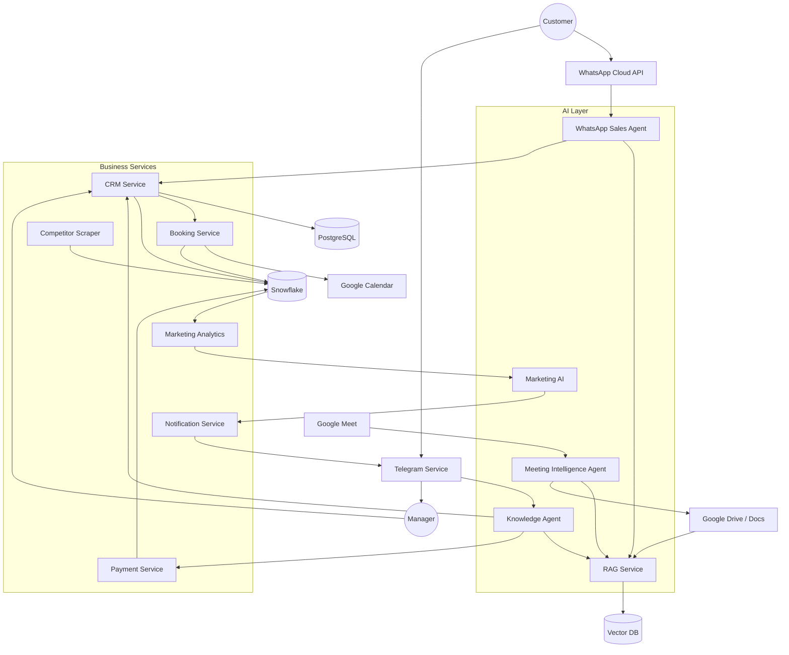
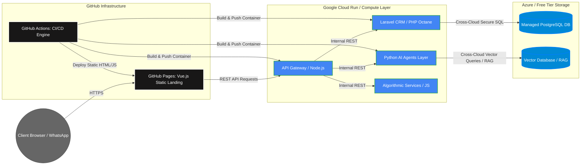

# UML / ARCHITECTURE DIAGRAMS

### 1. Component Diagram

```mermaid
graph TB
    %% Actors
    Customer((Customer))
    Manager((Manager))

    %% External Services
    WA_Cloud["WhatsApp Cloud API"]
    TG_Service["Telegram Service"]
    G_Meet["Google Meet"]
    G_Drive["Google Drive / Docs"]
    G_Calendar["Google Calendar"]

    %% AI Layer Package
    subgraph AI_Layer["AI Layer"]
        WA_Agent["WhatsApp Sales Agent"]
        TG_Agent["Knowledge Agent"]
        Meet_Agent["Meeting Intelligence Agent"]
        Mkt_AI["Marketing AI"]
        RAG["RAG Service"]
    end

    %% Business Services Package
    subgraph Business_Services["Business Services"]
        CRM["CRM Service"]
        Booking["Booking Service"]
        Payment["Payment Service"]
        Scraper["Competitor Scraper"]
        Mkt_Analytics["Marketing Analytics"]
        Notify["Notification Service"]
    end

    %% Databases
    PG[("PostgreSQL")]
    SF[("Snowflake")]
    VDB[("Vector DB")]

    %% Connections / Flows
    Customer --> WA_Cloud
    WA_Cloud --> WA_Agent
    
    Customer --> TG_Service
    TG_Service --> TG_Agent
    
    G_Meet --> Meet_Agent
    Meet_Agent --> RAG
    
    WA_Agent --> RAG
    TG_Agent --> RAG
    RAG --> VDB
    
    WA_Agent --> CRM
    TG_Agent --> CRM
    
    CRM --> PG
    
    Booking --> G_Calendar
    CRM --> Booking
    Booking --> SF
    
    Payment --> SF
    Scraper --> SF
    
    CRM --> SF
    SF --> Mkt_Analytics
    
    Mkt_Analytics --> Mkt_AI
    Mkt_AI --> Notify
    
    Notify --> TG_Service
    TG_Service --> Manager
    Manager --> CRM
    
    TG_Agent --> Payment
    Meet_Agent --> G_Drive
    G_Drive --> RAG
   
```
### 2. System Deployment

```mermaid
graph LR
    classDef github fill:#181717,stroke:#fff,stroke-width:2px,color:#fff;
    classDef gcp fill:#4285F4,stroke:#34A853,stroke-width:2px,color:#fff;
    classDef azure fill:#0089D6,stroke:#007FFF,stroke-width:2px,color:#fff;
    classDef user fill:#666,stroke:#333,stroke-width:1px,color:#fff;

    subgraph GH [GitHub Infrastructure]
        Pages[GitHub Pages: Vue.js Static Landing]:::github
        Actions[GitHub Actions: CI/CD Engine]:::github
    end

    subgraph GoogleCloud [Google Cloud Run / Compute Layer]
        GW[API Gateway / Node.js]:::gcp
        CRM[Laravel CRM / PHP Octane]:::gcp
        AI[Python AI Agents Layer]:::gcp
        Algo[Algorithmic Services / JS]:::gcp
    end

    subgraph MSAzure [Azure / Free Tier Storage]
        Postgres[(Managed PostgreSQL DB)]:::azure
        VectorDB[(Vector Database / RAG)]:::azure
    end

    %% Deployment Automation Flow
    Actions -->|Deploy Static HTML/JS| Pages
    Actions -->|Build & Push Container| GW
    Actions -->|Build & Push Container| CRM
    Actions -->|Build & Push Container| AI

    %% Production Runtime Traffic
    User((Client Browser / WhatsApp)):::user -->|HTTPS| Pages
    Pages -->|REST API Requests| GW
    
    GW -->|Internal REST| AI
    GW -->|Internal REST| CRM
    GW -->|Internal REST| Algo

    %% Cross-Cloud Data Connectivity
    CRM -->|Cross-Cloud Secure SQL| Postgres
    AI -->|Cross-Cloud Vector Queries / RAG| VectorDB
```

