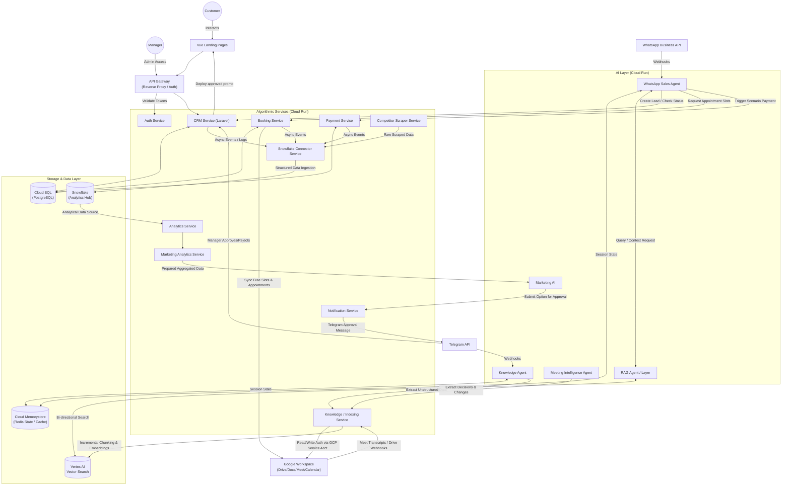
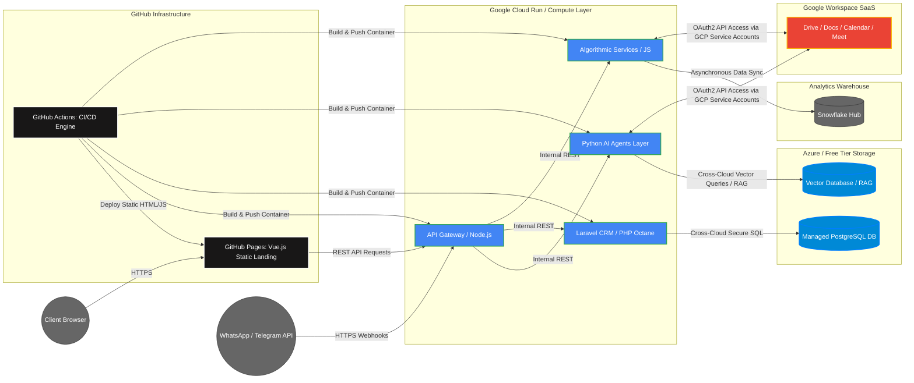
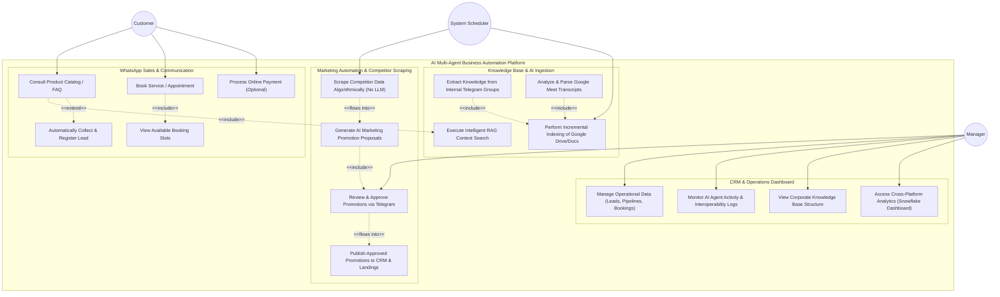

# UML / ARCHITECTURE DIAGRAMS

### 1. Component diagram

```mermaid
graph TB
    %% Actors / Clients
    Customer((Customer))
    Manager((Manager))
    Landings["Vue Landing Pages"]

    %% External Platforms
    WA_Cloud["WhatsApp Business API"]
    TG_Service["Telegram API"]
    G_Workspace["Google Workspace<br/>(Drive/Docs/Meet/Calendar)"]

    %% Infrastructure Components
    GW["API Gateway<br/>(Reverse Proxy / Auth)"]

    %% AI Layer (GCP Cloud Run)
    subgraph AI_Layer["AI Layer (Cloud Run)"]
        WA_Agent["WhatsApp Sales Agent"]
        TG_Agent["Knowledge Agent"]
        Meet_Agent["Meeting Intelligence Agent"]
        Mkt_AI["Marketing AI"]
        RAG_Layer["RAG Agent / Layer"]
    end

    %% Algorithmic Services (GCP Cloud Run)
    subgraph Algorithmic_Services["Algorithmic Services (Cloud Run)"]
        Auth_Svc["Auth Service"]
        CRM_Svc["CRM Service (Laravel)"]
        Booking_Svc["Booking Service"]
        Payment_Svc["Payment Service"]
        Scraper_Svc["Competitor Scraper Service"]
        Mkt_An_Svc["Marketing Analytics Service"]
        An_Svc["Analytics Service"]
        SF_Conn["Snowflake Connector Service"]
        Notify_Svc["Notification Service"]
        Index_Svc["Knowledge / Indexing Service"]
    end

    %% Storage Layer (GCP Managed + Snowflake)
    subgraph Storage_Layer["Storage & Data Layer"]
        PG[("Cloud SQL<br/>(PostgreSQL)")]
        Redis[("Cloud Memorystore<br/>(Redis State / Cache)")]
        VDB[("Vertex AI<br/>Vector Search")]
        SF[("Snowflake<br/>(Analytics Hub)")]
    end

    %% 1. External Ingress & Gateway Communication
    Customer -->|Interacts| Landings
    Landings --> GW
    Manager -->|Admin Access| GW
    GW -->|Validate Tokens| Auth_Svc

    %% 2. Webhooks & External Event Ingress
    WA_Cloud -->|Webhooks| WA_Agent
    TG_Service -->|Webhooks| TG_Agent
    G_Workspace -->|Meet Transcripts / Drive Webhooks| Index_Svc

    %% 3. AI Agents State & Operations
    WA_Agent <-->|Session State| Redis
    TG_Agent <-->|Session State| Redis
    
    %% 4. RAG & Knowledge Update Flows (Two-way communication fixed)
    RAG_Layer <-->|Bi-directional Search| VDB
    WA_Agent <-->|Query / Context Request| RAG_Layer

    %% 5. Knowledge Pipeline Flow
    TG_Agent -->|Extract Unstructured Data| Index_Svc
    Meet_Agent -->|Extract Decisions & Changes| Index_Svc
    Index_Svc -->|Read/Write Auth via GCP Service Acct| G_Workspace
    Index_Svc -->|Incremental Chunking & Embeddings| VDB

    %% 6. Algorithmic Service Routing (API Contracts)
    GW --> CRM_Svc
    WA_Agent -->|Create Lead / Check Status| CRM_Svc
    WA_Agent -->|Request Appointment Slots| Booking_Svc
    WA_Agent -->|Trigger Scenario Payment| Payment_Svc

    %% 7. Operational Storage Relations
    CRM_Svc <--> PG
    Booking_Svc <--> PG
    Payment_Svc <--> PG
    Booking_Svc -->|Sync Free Slots & Appointments| G_Workspace

    %% 8. Analytical Data Pipelines (Asynchronous Pub/Sub)
    CRM_Svc -->|Async Events / Logs| SF_Conn
    Booking_Svc -->|Async Events| SF_Conn
    Payment_Svc -->|Async Events| SF_Conn
    Scraper_Svc -->|Raw Scraped Data| SF_Conn
    SF_Conn -->|Structured Data Ingestion| SF

    %% 9. Marketing AI Feedback Loop
    SF -->|Analytical Data Source| An_Svc
    An_Svc --> Mkt_An_Svc
    Mkt_An_Svc -->|Prepared Aggregated Data| Mkt_AI
    Mkt_AI -->|Submit Option for Approval| Notify_Svc
    Notify_Svc -->|Telegram Approval Message| TG_Service
    TG_Service -->|Manager Approves/Rejects| CRM_Svc
    CRM_Svc -->|Deploy approved promo| Landings
```
### 2. Deployment diagram

```mermaid
graph LR
    classDef github fill:#181717,stroke:#fff,stroke-width:2px,color:#fff;
    classDef gcp fill:#4285F4,stroke:#34A853,stroke-width:2px,color:#fff;
    classDef azure fill:#0089D6,stroke:#007FFF,stroke-width:2px,color:#fff;
    classDef workspace fill:#EA4335,stroke:#FBBC05,stroke-width:2px,color:#fff;
    classDef user fill:#666,stroke:#333,stroke-width:1px,color:#fff;

    subgraph GH [GitHub Infrastructure]
        Pages[GitHub Pages: Vue.js Static Landing]:::github
        Actions[GitHub Actions: CI/CD Engine]:::github
    end

    subgraph GoogleCloud [Google Cloud Run / Compute Layer]
        GW[API Gateway / Node.js]:::gcp
        CRM[Laravel CRM / PHP Octane]:::gcp
        AI[Python AI Agents Layer]:::gcp
        Algo[Algorithmic Services / JS]:::gcp
    end

    subgraph MSAzure [Azure / Free Tier Storage]
        Postgres[(Managed PostgreSQL DB)]:::azure
        VectorDB[(Vector Database / RAG)]:::azure
    end

    subgraph GWorkspace [Google Workspace SaaS]
        Workspace_API["Drive / Docs / Calendar / Meet"]:::workspace
    end

    subgraph Analytics_Hub [Analytics Warehouse]
        Snowflake[(Snowflake Hub)]:::user
    end

    %% Deployment Automation Flow (Добавлен деплой для Algo)
    Actions -->|Deploy Static HTML/JS| Pages
    Actions -->|Build & Push Container| GW
    Actions -->|Build & Push Container| CRM
    Actions -->|Build & Push Container| AI
    Actions -->|Build & Push Container| Algo

    %% Production Runtime Traffic (Разделен трафик браузера и вебхуков мессенджеров)
    User_Browser((Client Browser)):::user -->|HTTPS| Pages
    Webhooks((WhatsApp / Telegram API)):::user -->|HTTPS Webhooks| GW
    Pages -->|REST API Requests| GW
    
    GW -->|Internal REST| AI
    GW -->|Internal REST| CRM
    GW -->|Internal REST| Algo

    %% Cross-Cloud Data Connectivity & Integrations (Добавлен Snowflake и Workspace)
    CRM -->|Cross-Cloud Secure SQL| Postgres
    AI -->|Cross-Cloud Vector Queries / RAG| VectorDB
    Algo -->|Asynchronous Data Sync| Snowflake
    AI & Algo <-->|OAuth2 API Access via GCP Service Accounts| Workspace_API
```

### 3. Use case diagram

```mermaid
graph TB
    %% Actors
    Customer((Customer))
    Manager((Manager))
    Scheduler((System Scheduler))

    %% System Boundary
    subgraph Platform["AI Multi-Agent Business Automation Platform"]
        
        %% WhatsApp Sales Agent Module (Section 3.1 & 4.1)
        subgraph SalesModule["WhatsApp Sales & Communication"]
            UC_Msg["Consult Product Catalog / FAQ"]
            UC_Lead["Automatically Collect & Register Lead"]
            UC_Slot["View Available Booking Slots"]
            UC_Book["Book Service / Appointment"]
            UC_Pay["Process Online Payment (Optional)"]
        end

        %% Knowledge & RAG Module (Section 3.1, 3.3, 4.3 & 6)
        subgraph KnowledgeModule["Knowledge Base & AI Ingestion"]
            UC_TG_Intel["Extract Knowledge from Internal Telegram Groups"]
            UC_Meet_Intel["Analyze & Parse Google Meet Transcripts"]
            UC_RAG_Search["Execute Intelligent RAG Context Search"]
            UC_Index["Perform Incremental Indexing of Google Drive/Docs"]
        end

        %% Marketing Automation & Scraper Module (Section 3.1, 3.4, 10 & 11)
        subgraph MarketingModule["Marketing Automation & Competitor Scraping"]
            UC_Scrape["Scrape Competitor Data Algorithmically (No LLM)"]
            UC_Gen_Promo["Generate AI Marketing Promotion Proposals"]
            UC_Approve["Review & Approve Promotions via Telegram"]
            UC_Pub_Promo["Publish Approved Promotions to CRM & Landings"]
        end

        %% CRM & Analytics Dashboard Module (Section 7 & 12)
        subgraph AdminModule["CRM & Operations Dashboard"]
            UC_View_CRM["Manage Operational Data (Leads, Pipelines, Bookings)"]
            UC_View_Logs["Monitor AI Agent Activity & Interoperability Logs"]
            UC_View_KB["View Corporate Knowledge Base Structure"]
            UC_View_BI["Access Cross-Platform Analytics (Snowflake Dashboard)"]
        end
    end

    %% Customer Relationships
    Customer --> UC_Msg
    Customer --> UC_Book
    Customer --> UC_Pay

    %% Internal Include / Flow Dependencies
    UC_Msg -.->|&lt;&lt;include&gt;&gt;| UC_RAG_Search
    UC_Msg -.->|&lt;&lt;extend&gt;&gt;| UC_Lead
    UC_Book -.->|&lt;&lt;include&gt;&gt;| UC_Slot
    
    UC_TG_Intel -.->|&lt;&lt;include&gt;&gt;| UC_Index
    UC_Meet_Intel -.->|&lt;&lt;include&gt;&gt;| UC_Index

    %% System Scheduler Relationships
    Scheduler --> UC_Scrape
    Scheduler --> UC_Index

    %% Marketing Cycle Flow
    UC_Scrape -.->|&lt;&lt;flows into&gt;&gt;| UC_Gen_Promo
    UC_Gen_Promo -.->|&lt;&lt;include&gt;&gt;| UC_Approve
    UC_Approve -.->|&lt;&lt;flows into&gt;&gt;| UC_Pub_Promo

    %% Manager Relationships
    Manager --> UC_Approve
    Manager --> UC_View_CRM
    Manager --> UC_View_Logs
    Manager --> UC_View_KB
    Manager --> UC_View_BI
```
