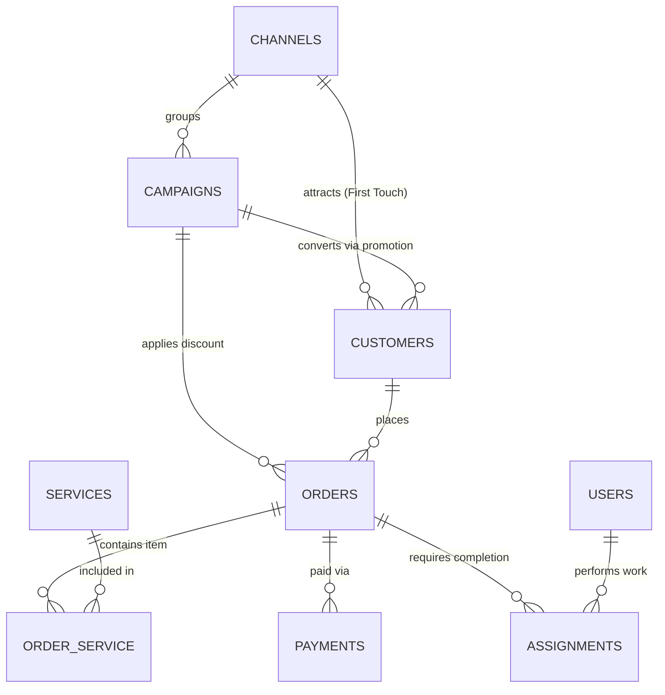

# Technical Documentation: B2C CRM Database

## 1. Purpose and Architectural Pattern
DBMS: PostgreSQL 14+  
Architectural Pattern: B2C Service Sales & Execution Model  
ORM: Laravel Eloquent  
The system is designed to manage the lifecycle of B2C services. The architecture implements an end-to-end chain: Source (Channel/Campaign) -> Customer Profile -> Order -> Service Composition -> Financial Transaction -> Executor Assignment.

## 2. Entity-Relationship Diagram (ERD)

## 3.1. Users and Executors (Core / Auth)
Table: users  
System users (managers, technicians/executors, administrators). Tasks in assignments reference this table.

* id (BIGSERIAL, PK) — Unique employee identifier.
* name (VARCHAR(255), NOT NULL) — Full name of the employee.
* email (VARCHAR(255), UNIQUE, NOT NULL) — Work email / login.
* password (VARCHAR(255), NOT NULL) — Password hash.
* role (VARCHAR(50), DEFAULT 'executor') — System role (admin, manager, executor).
* phone (VARCHAR(32), NULLABLE) — Contact phone number.
* is_active (BOOLEAN, DEFAULT true) — System access flag.
* created_at, updated_at (TIMESTAMP(0)) — System timestamps.

## 3.2. Marketing and Acquisition Sources
Table: channels  
Top-level traffic and inquiry sources.

* id (BIGSERIAL, PK) — Unique channel identifier.
* name (VARCHAR(255), NOT NULL) — Channel name (Office Call, Direct Visit, Telegram Bot, Google Ads).
* type (VARCHAR(50), NOT NULL) — Source type (online, offline).
* is_active (BOOLEAN, DEFAULT true) — Channel status.
* created_at, updated_at (TIMESTAMP(0)).

Table: campaigns  
Marketing promotions, special offers, and ad campaigns within channels.

* id (BIGSERIAL, PK) — Unique campaign identifier.
* channel_id (BIGINT, FK -> channels.id ON DELETE CASCADE) — Channel reference.
* name (VARCHAR(255), NOT NULL) — Campaign name (Flyer Discount, Summer Offer).
* promo_code (VARCHAR(50), UNIQUE, NULLABLE) — Promotional code.
* budget (NUMERIC(12,2), DEFAULT 0.00) — Campaign expenses for ROI calculations.
* start_date, end_date (DATE, NULLABLE) — Validity period.
* created_at, updated_at (TIMESTAMP(0)).

## 3.3. Customer Module
Table: customers  
Profiles of individual B2C clients.

* id (BIGSERIAL, PK) — Unique customer identifier.
* name (VARCHAR(255), NOT NULL) — Full name or name of the client.
* phone (VARCHAR(32), NOT NULL, INDEX) — Primary phone number.
* email (VARCHAR(255), NULLABLE) — Email address.
* channel_id (BIGINT, FK -> channels.id ON DELETE SET NULL) — Initial acquisition channel.
* campaign_id (BIGINT, FK -> campaigns.id ON DELETE SET NULL) — First-contact campaign.
* entry_point (VARCHAR(50), DEFAULT 'office') — First contact method (call, promo, office).
* created_at, updated_at (TIMESTAMP(0)).

## 3.4. Service Catalog
Table: services  
Nomenclature directory of provided services.

* id (BIGSERIAL, PK) — Unique service identifier.
* name (VARCHAR(255), NOT NULL) — Service name.
* price (NUMERIC(10,2), NOT NULL) — Base cost.
* is_active (BOOLEAN, DEFAULT true) — Availability for ordering.
* created_at, updated_at (TIMESTAMP(0)).

## 3.5. Sales and Finance
Table: orders  
Main deal document.

* id (BIGSERIAL, PK) — Unique order number.
* customer_id (BIGINT, FK -> customers.id ON DELETE CASCADE) — Client/Customer.
* campaign_id (BIGINT, FK -> campaigns.id ON DELETE SET NULL) — Campaign applied to this specific sale.
* status (VARCHAR(50), DEFAULT 'new', INDEX) — Order status (new, in_progress, completed, cancelled).
* payment_status (VARCHAR(50), DEFAULT 'unpaid') — Payment status (unpaid, partial, paid).
* discount_amount (NUMERIC(10,2), DEFAULT 0.00) — Discount amount.
* total_amount (NUMERIC(10,2), NOT NULL) — Total amount due.
* created_at, updated_at (TIMESTAMP(0)).

Table: order_service (Pivot / Order Composition)  
Many-to-many junction table between orders and services.

* id (BIGSERIAL, PK) — Unique line item identifier.
* order_id (BIGINT, FK -> orders.id ON DELETE CASCADE) — Order reference.
* service_id (BIGINT, FK -> services.id ON DELETE RESTRICT) — Service reference.
* quantity (INTEGER, DEFAULT 1) — Quantity.
* price (NUMERIC(10,2), NOT NULL) — Locked price at time of sale (historical cost).

Table: payments  
Financial transactions for orders.

* id (BIGSERIAL, PK) — Payment identifier.
* order_id (BIGINT, FK -> orders.id ON DELETE CASCADE, INDEX) — Order being paid.
* amount (NUMERIC(10,2), NOT NULL) — Payment amount.
* method (VARCHAR(50), NOT NULL) — Payment method (cash, card, terminal, transfer).
* paid_at (TIMESTAMP(0), NOT NULL) — Exact payment processing timestamp.
* created_at, updated_at (TIMESTAMP(0)).

## 3.6. Fulfillment Module (Assignments)
Table: assignments  
Assignment of specific employees/executors (users) to orders.

* id (BIGSERIAL, PK) — Assignment identifier.
* order_id (BIGINT, FK -> orders.id ON DELETE CASCADE, INDEX) — Assigned order.
* executor_id (BIGINT, FK -> users.id ON DELETE CASCADE, INDEX) — Assigned employee/master.
* status (VARCHAR(50), DEFAULT 'pending') — Work status (pending, in_progress, done).
* start_date (TIMESTAMP(0), NULLABLE) — Scheduled/actual start time.
* due_date (TIMESTAMP(0), NULLABLE) — Deadline.
* created_at, updated_at (TIMESTAMP(0)).
