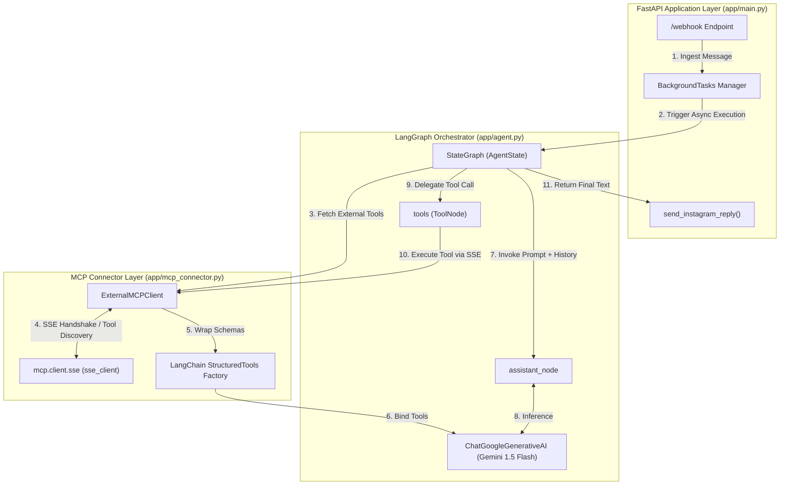
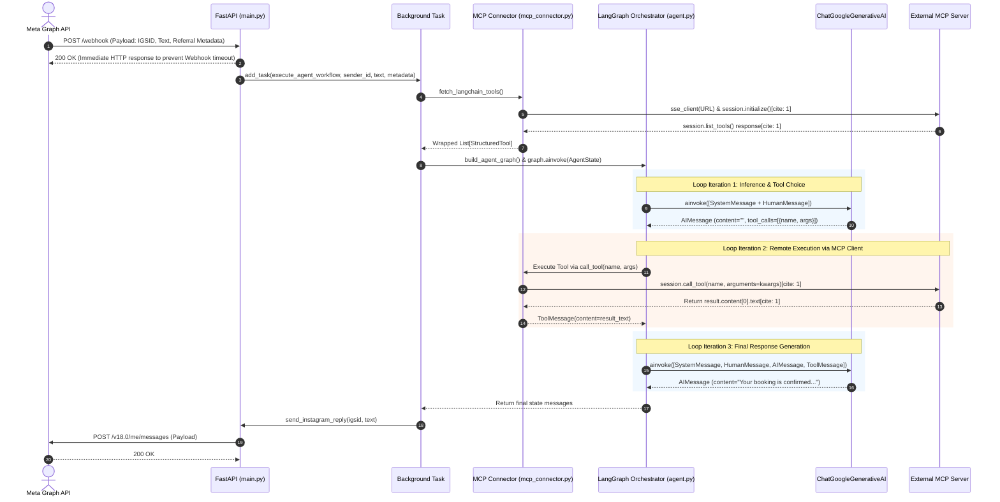
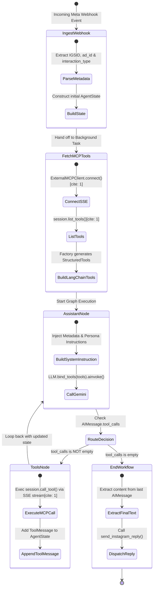
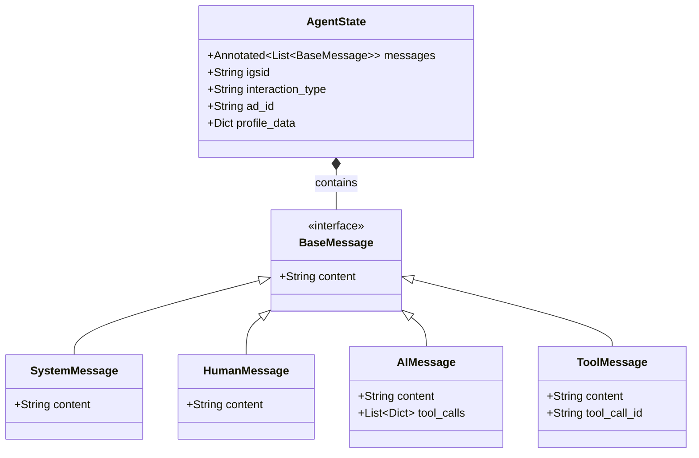

# Specification: Instagram LLM Sales Bot Agent Microservice

## 1. Project Overview & Architectural Scope

This specification defines the internal architecture, file layout, state management, execution workflows, and interaction models strictly for the **Instagram LLM Bot Microservice** (`ig_bot_microservice`).

The Agent acts as an autonomous, event-driven orchestrator built on **FastAPI**, **LangGraph**, and **Google Gemini** (`gemini-1.5-flash`), consuming tools exposed by an external Model Context Protocol (MCP) Server via SSE.

---

## 2. Project Structure & File Layout

```text
/ig_bot_microservice
├── Dockerfile                  # Container image definition (Python 3.11-slim)
├── docker-compose.yml          # Container orchestration and environment mapping
├── requirements.txt            # Python dependencies (FastAPI, LangGraph, MCP, etc.)
└── app/
    ├── __init__.py             # Module initialization
    ├── main.py                 # FastAPI application, webhook handlers & Meta API client
    ├── agent.py                # LangGraph state machine & Gemini LLM orchestration
    └── mcp_connector.py        # SSE client & dynamic LangChain tool generator

```

---

## 3. Environment Variables & Runtime Configuration

| Variable Name | Type | Description | Example / Default |
| --- | --- | --- | --- |
| `GEMINI_API_KEY` | String (Secret) | Authentication key for Google Gemini model API calls (`gemini-1.5-flash`). | `AIzaSy...` |
| `META_VERIFY_TOKEN` | String (Secret) | Custom challenge verification token configured in the Meta Developer Portal. | `my_secure_token_123` |
| `META_PAGE_ACCESS_TOKEN` | String (Secret) | Long-lived page token for dispatching messages via Meta Graph API v18.0. | `EAAX...` |
| `MCP_SERVER_SSE_URL` | String (URL) | Full SSE endpoint URL of the external Symfony MCP Server microservice. | `http://mcp-server:8000/mcp` |

---

## 4. Internal Component Architecture



---

## 5. Agent Use-Case Model


---

## 6. End-to-End Agent Sequence Diagram



---

## 7. LangGraph State Machine & Control Flow



---

## 8. Agent State Model (`AgentState` Schema)



---

## 9. Component & Module Breakdown

### 9.1 Webhook Transport & Messaging (`app/main.py`)

* **Endpoint `GET /webhook`:**
* Verifies incoming challenge requests from Meta.
* Validates `hub.mode == 'subscribe'` and `hub.verify_token == META_VERIFY_TOKEN`.
* Returns `hub.challenge` as an integer on success, or raises `HTTPException(403)` on failure.


* **Endpoint `POST /webhook`:**
* Ingests JSON webhooks from Instagram Direct messaging.
* Filters out system noise, empty sender IDs, and echo messages (`is_echo == True`).
* Extracts referral metadata (`ad_id`, `interaction_type`) from payload postbacks or referral objects.
* **Non-blocking Execution:** Offloads heavy LLM and MCP tool execution to FastAPI's `BackgroundTasks` to respond with `200 OK` within Meta’s required 5-second timeout window.


* **Outbound Client (`send_instagram_reply`):**
* Dispatches final text responses asynchronously using `httpx.AsyncClient` to `[https://graph.facebook.com/v18.0/me/messages](https://graph.facebook.com/v18.0/me/messages)`.


### 9.2 LangGraph Orchestrator (`app/agent.py`)

* **State Schema (`AgentState`):**
* `messages`: Appending message history managed by `add_messages`.
* `igsid`: Target Instagram Scoped User ID.
* `interaction_type`: Entry vector (`direct_message`, `ad_referral`, etc.).
* `ad_id`: Linked Meta Ad Campaign ID (or `"none"`).
* `profile_data`: Extracted user profile context.


* **Assistant Node (`assistant_node`):**
* Injects a dynamic system prompt containing the client's context (`IGSID`, `ad_id`, `interaction_type`).
* Binds dynamically loaded tools (`llm.bind_tools(tools)`) to `ChatGoogleGenerativeAI`.
* Invokes Gemini with low temperature (`0.2`) to ensure deterministic tool arguments.


* **Conditional Routing (`route_to_tools`):**
* Evaluates the last `AIMessage` in the state.
* If `tool_calls` exist, routes execution to `ToolNode`.
* If no `tool_calls` are present, terminates execution (`END`) and hands off the message to the dispatch layer.


### 9.3 MCP SSE Connector (`app/mcp_connector.py`)

* **Transport Session (`ExternalMCPClient.connect`):**
* Establishes a persistent SSE stream using `mcp.client.sse.sse_client` and `ClientSession`.


* Performs the standard MCP JSON-RPC protocol initialization handshake (`session.initialize()`).


* **Dynamic Tool Factory (`fetch_langchain_tools`):**
* Fetches available tool definitions from the external Symfony MCP Server via `session.list_tools()`.


* Maps MCP parameter schemas directly into native LangChain `StructuredTool` instances.
* Wraps execution inside an async closure that executes `session.call_tool()` over SSE streams and returns the text result.


---

## 10. Execution Lifecycle & Error Handling Strategy

1. **Meta Webhook Ingestion:** Fast 200 OK acknowledgement prevents duplicate webhook retries from Meta.
2. **MCP Discovery Failure:** If the Symfony MCP Server is unreachable, `ExternalMCPClient` catches connection errors, falling back gracefully to pure text generation without tool bindings.
3. **Tool Execution Error:** If an external MCP tool execution fails (e.g., CRM offline, Google Calendar rate limited), the error string is formatted into a `ToolMessage` and returned to Gemini so the model can inform the user or attempt an alternative action.
4. **State Isolation:** Every user message generates an isolated `AgentState` execution graph, preventing cross-talk between concurrent Instagram Direct conversations.
