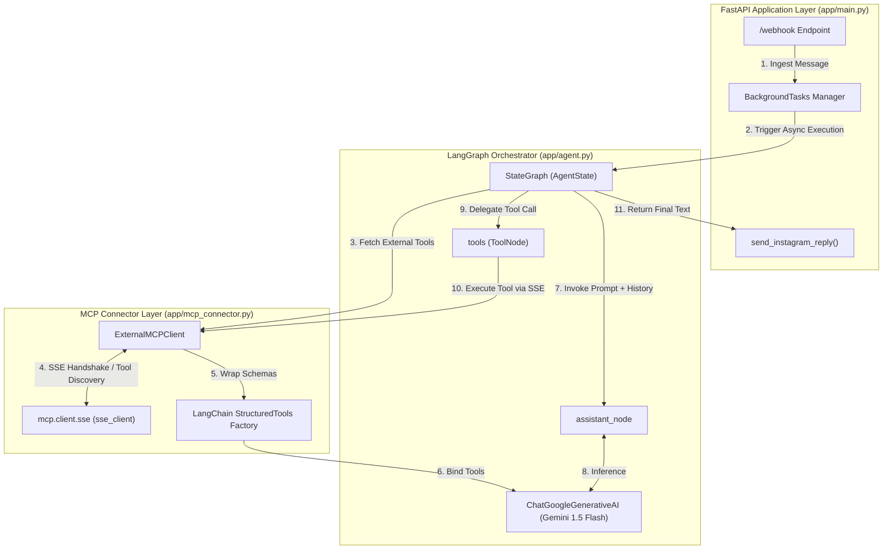
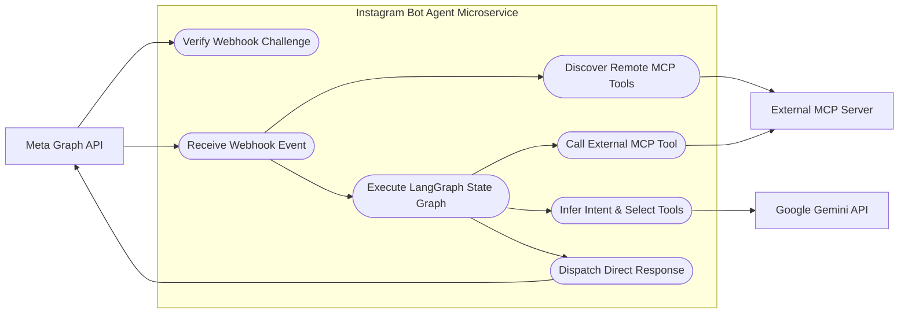
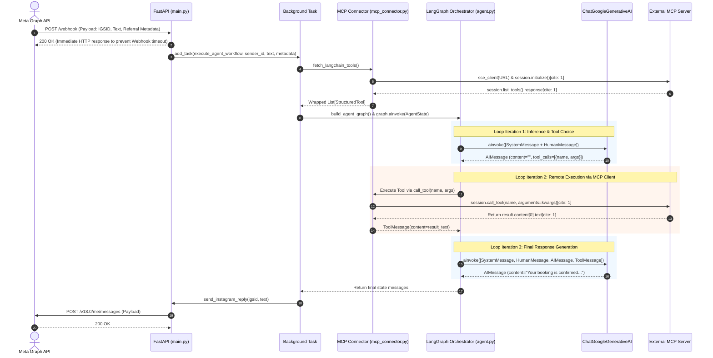
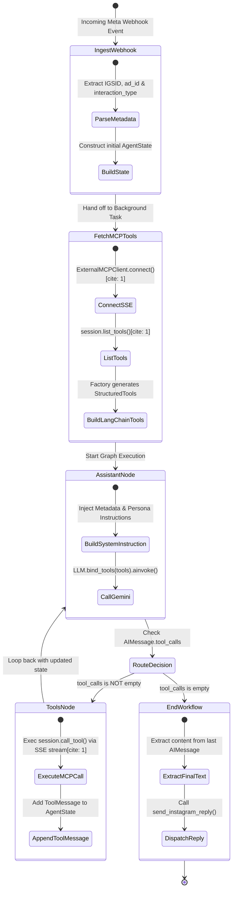
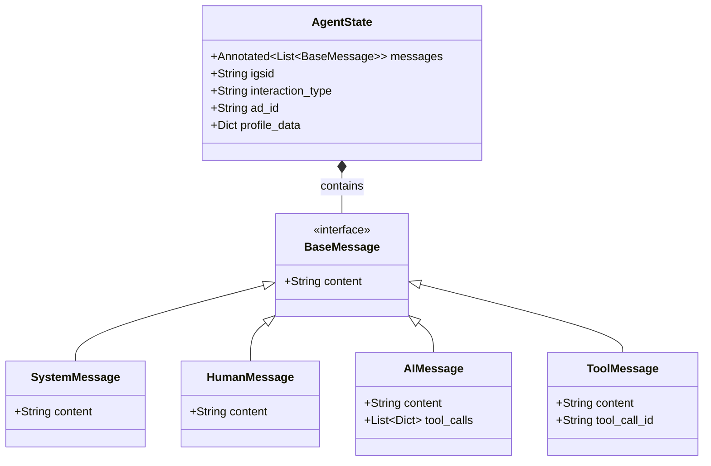

# Specification: Instagram LLM Sales Bot Agent Microservice

## 1. Microservice Architectural Scope

This specification defines the internal architecture, state management, execution workflows, and interaction models strictly for the **Instagram LLM Bot Microservice** (`ig_bot_microservice`).

The Agent acts as an autonomous, event-driven orchestrator built on **FastAPI**, **LangGraph**, and **Google Gemini** (`gemini-1.5-flash`), consuming tools exposed by an external Model Context Protocol (MCP) Server via SSE.

---

## 2. Internal Component Architecture

---

## 3. Agent Use-Case Model

---

## 4. End-to-End Agent Sequence Diagram

---

## 5. LangGraph State Machine & Control Flow

---

## 6. Agent State Model (`AgentState` Schema)

---

## 7. Component Responsibilities & Boundaries

* **`app/main.py`**: Webhook endpoint handler (`/webhook`). Validates tokens with Meta, ingests user payloads, returns HTTP 200 OK immediately, and offloads processing to `BackgroundTasks` to prevent Meta webhook timeouts.
* **`app/agent.py`**: Compiles the `LangGraph` StateGraph workflow. Injects system instructions with runtime metadata (`igsid`, `ad_id`, `interaction_type`), handles non-blocking LLM calls with Gemini, and manages state transition loops.
* **`app/mcp_connector.py`**: Connects via SSE to the external MCP Server. Converts raw JSON-RPC tool schemas into native LangChain `StructuredTool` instances, maintaining dynamic parameter schema compatibility for LLM tool calling.
