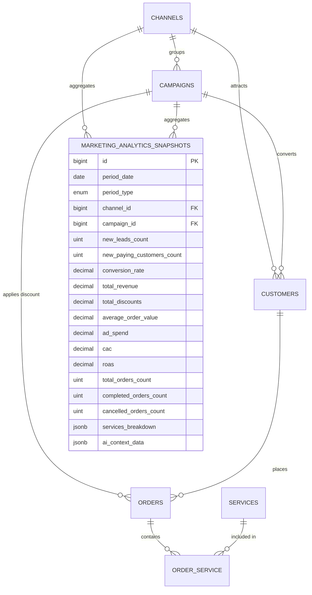
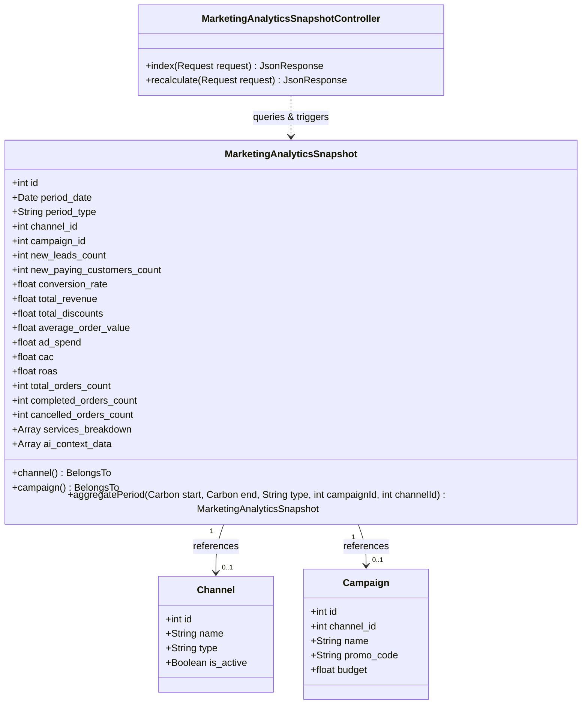
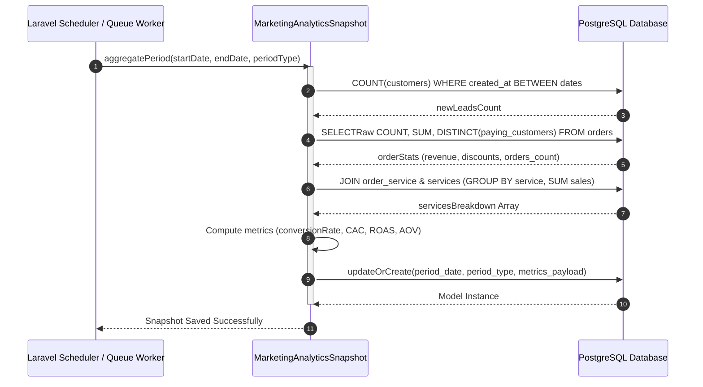
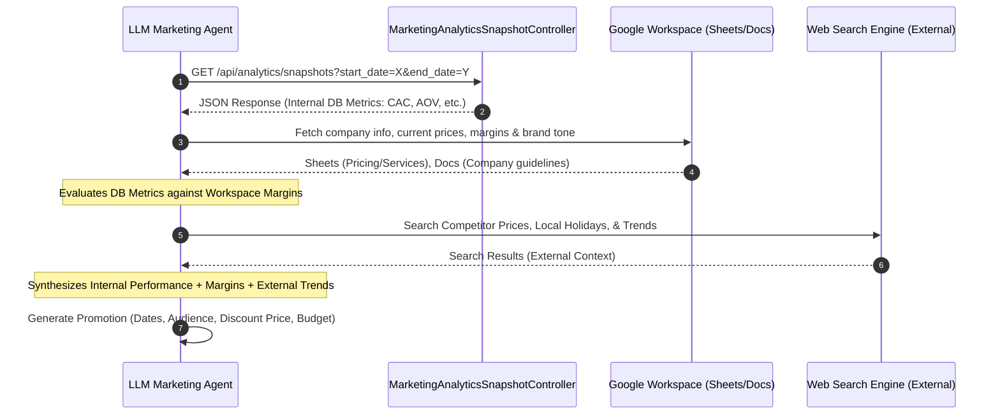
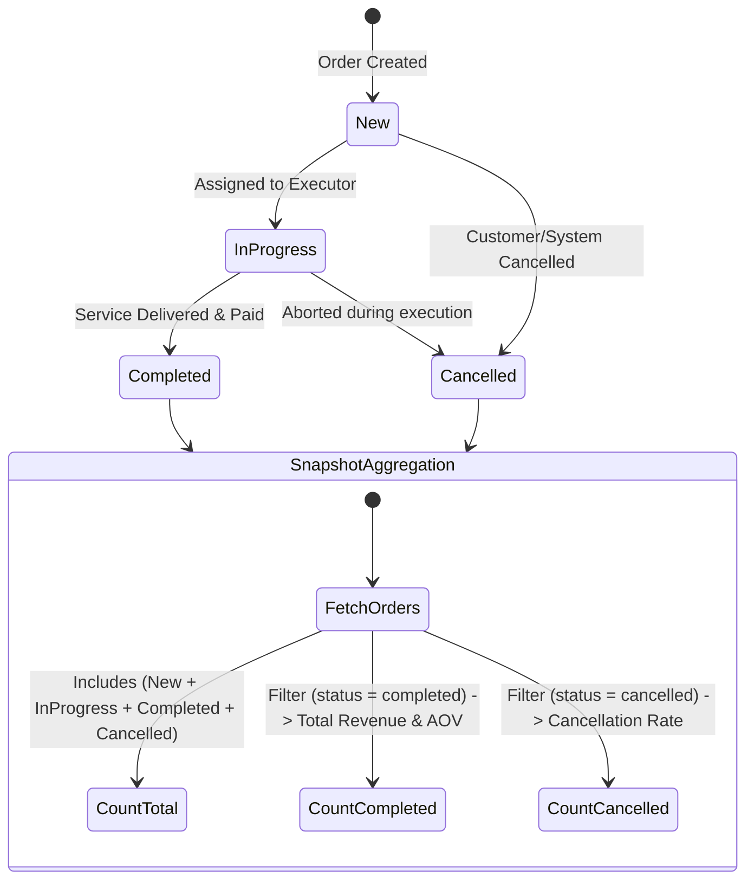
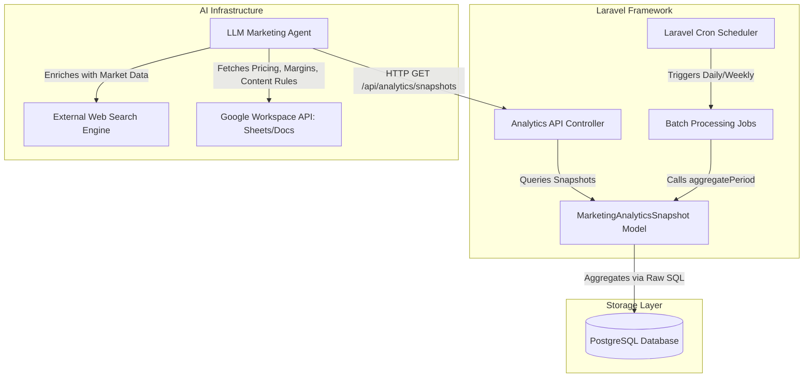
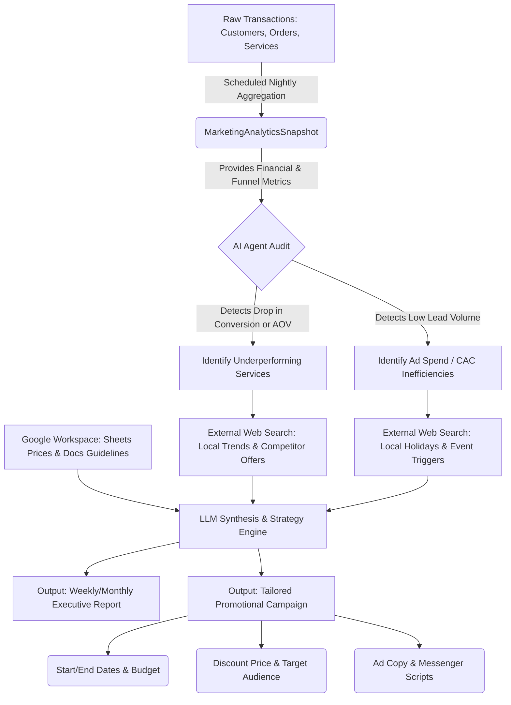

### 1. ER Diagram: Core Analytics Domain




### 2. Class Diagram: Core Analytics Domain




### 3. Sequence Diagram: Scheduled Batch Aggregation Workflow




### 4. Sequence Diagram: AI Agent Context Retrieval & Promotion Generation




### 5. State Diagram: Order Lifecycle Impact on Snapshots




### 6. System Component Architecture



### 7. Flowchart: End-to-End Analytics & Campaign Generation Pipeline




---

### External Market Search Requirements for AI Agent

When the LLM Agent reads internal aggregate metrics from `MarketingAnalyticsSnapshot` (such as `conversion_rate`, `cac`, `roas`, `average_order_value`, and `services_breakdown`), internal numbers alone only explain **what happened**, not **why** or **how to fix it**.

Grounded in classic marketing literature—such as **Philip Kotler’s Environmental Scanning & PESTLE Framework** (Marketing Management), **Avinash Kaushik’s Contextual Benchmarking** (Web Analytics 2.0), and **W. Chan Kim’s Non-Customer Analysis** (Blue Ocean Strategy)—the LLM agent must enrich internal snapshot data with specific web search queries **and cross-reference them with Google Workspace documents (prices, margins, brand info)** to generate actionable campaign parameters.

```text
+-------------------------------------------------------------+
|               AI Agent Decision Loop                        |
|                                                             |
|   +-----------------------------------------------------+   |
|   |  Internal Snapshot Metrics (DB)                     |   |
|   |  (Revenue, CAC, AOV, Services Breakdown)            |   |
|   +--------------------------+--------------------------+   |
|                              |                              |
|   +-----------------------------------------------------+   |
|   |  Internal Company Context (Google Workspace)        |   |
|   |  (Sheets: Margins/Prices | Docs: Brand Guidelines)  |   |
|   +--------------------------+--------------------------+   |
|                              |                              |
|                              v                              |
|   +-----------------------------------------------------+   |
|   |  Strategic Gap Identification                       |   |
|   |  (e.g., Hair Salon AOV drop, Massage CAC spike)     |   |
|   +--------------------------+--------------------------+   |
|                              |                              |
|                              v                              |
|   +-----------------------------------------------------+   |
|   |  Targeted External Web Search                       |   |
|   |  (Competitors, Holidays, Weather, Local Trends)     |   |
|   +--------------------------+--------------------------+   |
|                              |                              |
|                              v                              |
|   +-----------------------------------------------------+   |
|   |  Synthesized Promotional Strategy & Execution       |   |
|   |  (Generates Dates, Audience, Price, Budget, Copy)   |   |
|   +-----------------------------------------------------+   |
+-------------------------------------------------------------+

```

#### 1. Local Holidays, Micro-Events, and Trigger Calendar

* **Internal Trigger**: Low `new_leads_count` or upcoming historically low revenue periods in `period_date`.
* **Workspace Constraint**: Agent checks Google Sheets for staff availability/shifts and baseline service prices.
* **Theoretical Framework**: Kotler's Promotional Timing & Demand Shaping. Service demand in beauty and wellness is highly cyclical and date-driven.
* **External Data to Search**: Upcoming Local Public Holidays, Micro-Events (proms, wedding expos), Weather & Seasonal Shifts (e.g., heatwaves driving demand for pedicures or cooling body wraps).
* **Agent Output Generation**: Agent sets exact **Start and End Dates** for the campaign (e.g., running 5 days prior to a local festival) and selects the **Target Audience** (e.g., female clients aged 25-45).

#### 2. Competitor Intelligence & Pricing Benchmarks

* **Internal Trigger**: Declining `conversion_rate` or dropping `average_order_value` (AOV) for specific items in `services_breakdown`.
* **Workspace Constraint**: Agent reads Google Sheets to determine the maximum allowable **Discount Price** without violating the profit margin threshold for services like a 60-min massage.
* **Theoretical Framework**: Avinash Kaushik’s Competitive Intelligence & Contextual Benchmarking. Drop in conversion without changes to ad spend usually indicates competitor offer aggression.
* **External Data to Search**: Competitor Pricing & Package Bundles on Google Maps/Instagram, Active Competitor Promotions, Customer Complaints on Competitor Reviews to extract value differentiators.
* **Agent Output Generation**: Agent calculates a specific **Discount Price** or bundle value, and allocates a specific **Ad Budget** based on the required CAC to outbid local competitors.

#### 3. Macro Trends & Service Innovations

* **Internal Trigger**: Stagnant repeat bookings or dropping `roas` on long-running campaigns.
* **Workspace Constraint**: Agent reads Google Docs to ensure the generated promotional copy matches the company's brand voice (e.g., maintaining a relaxing, premium "В ритме моря" tone rather than aggressive sales jargon).
* **Theoretical Framework**: W. Chan Kim & Renée Mauborgne's Blue Ocean Strategy (Value Innovation). Instead of discounting core services in a red ocean, bundle high-value, low-cost trending procedures.
* **External Data to Search**: Trending Hair Care Procedures (e.g., Scalp Detox, Glossing), Trending Massage & Wellness Procedures (e.g., Lymphatic Drainage, Sound bath), Seasonal Beauty Needs.
* **Agent Output Generation**: Agent drafts the final **Ad Copy** and WhatsApp/Telegram messenger scripts incorporating the trending keywords found online, tailored to the brand's services.

#### 4. Market Search Matrix for AI Agent Prompts

| Internal Snapshot Condition | Identified Anomaly | External Search Strategy + Workspace Check | Target Output Action (Generated Parameters) |
| --- | --- | --- | --- |
| `services_breakdown` shows low massage sales, but high hair salon sales | Cross-sell inefficiency | Search: "Trending relaxation add-ons for salon clients". Check Sheets for massage oil costs. | Generate **Bundle Promo**: "Express Relaxation". Set **Discount Price**: 15%. Define **Audience**: Past hair clients. |
| `cac` rises above target on campaigns | Ad fatigue or high competition | Search: "Current local hair/massage competitor promos in [City]". Check Docs for brand USP. | Generate **New Ad Copy** highlighting unique value over competitors. Reallocate **Budget**: Focus 80% on retargeting. |
| `period_date` approaches 2–3 weeks before major holiday | Demand spike opportunity | Search: "Local holiday event calendar [City] next month". Check Sheets for peak pricing rules. | Generate **Campaign Dates**: 14 days before holiday. Set **Price**: Early-bird rate. Draft **Copy**: "Lock in your spot". |
| High `cancelled_orders_count` | Customer attrition / friction | Search: "Best customer retention offers beauty salon industry". Check Sheets for maximum retention discount. | Generate **Win-back Campaign**. Set **Audience**: Inactive > 60 days. Set **Discount**: Highest allowable margin threshold. |
