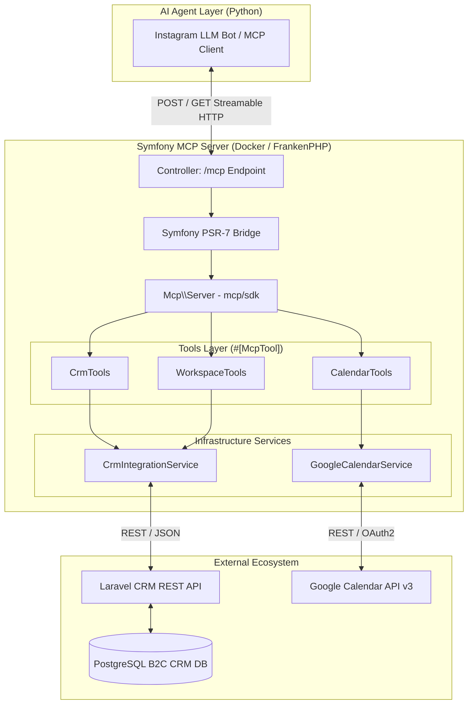
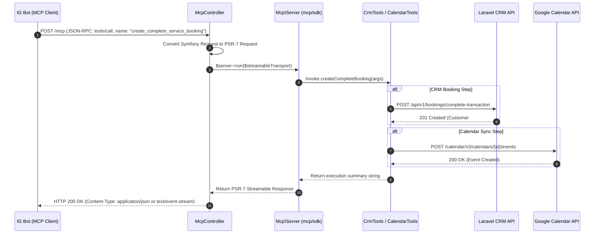

# Symfony MCP Server Microservice Specification

## 1. Project Overview

This microservice acts as a **Model Context Protocol (MCP) Server**, providing a standardized tool-calling interface for AI agents (e.g., the Instagram LLM Bot). It bridges the gap between the AI ecosystem, a **Laravel-based B2C CRM** (handling Channels, Campaigns, Customers, Orders, and Assignments), and **Google Calendar API**.

The microservice is built on top of the **official PHP MCP SDK (`mcp/sdk`)** maintained in collaboration with The PHP Foundation. It utilizes attribute-based tool declaration (`#[McpTool]`) and `StreamableHttpTransport` to expose robust tools for full B2C customer journey management.

### Target Audience

* **Human Developers:** Architecture, protocol implementation, tool schema definitions, and deployment guidelines.
* **AI Coding Assistants:** Tool attributes, dependency mapping, and external API contracts.

---

## 2. Technology Stack & Frameworks

### Core Infrastructure

* **Language:** PHP 8.3+ (Strict typing, attributes, read-only properties, match expressions).
* **Framework:** Symfony 7.x (Routing, Dependency Injection, HTTP Foundation).
* **MCP Engine:** Official PHP MCP SDK (`mcp/sdk` ^0.1).

* **PSR-7 Bridge:** `nyholm/psr7` & `symfony/psr-http-message-bridge` (for HTTP transport compatibility).

* **Application Server:** FrankenPHP (Go-based application server for high-throughput HTTP streaming).
* **Containerization:** Docker & Docker Compose.

### Integration Layer

* **Protocol:** JSON-RPC 2.0 over Streamable HTTP (MCP Standard).

* **HTTP Client:** Symfony HttpClient (Async, scoped requests).
* **Target Systems:**
* **Laravel CRM:** B2C Service Sales & Execution model (PostgreSQL).

* **Google Calendar API v3:** Master schedule management.

---

## 3. Architectural Approach & Patterns

### 3.1 Attribute-Driven Capability Discovery

Using `mcp/sdk`, capabilities are defined directly in dedicated Tool classes (`src/Tools/`) using PHP 8 attributes (`#[McpTool]`, `#[Schema]`). Schema validation and tool documentation are automatically generated by the SDK from method signatures and docblocks.

### 3.2 Streamable HTTP Transport

Replaces legacy SSE polling loops with standard `StreamableHttpTransport`. Requests arriving at Symfony's `/mcp` endpoint are converted to PSR-7 `ServerRequestInterface` instances, processed by `Mcp\Server`, and streamed directly back to the client.

### 3.3 Domain Separation of Tools (SoC)

Tool execution logic is strictly categorized by domain responsibility:

* **`CrmTools`:** Handles B2C entity creation and management (`customers`, `channels`, `campaigns`, `assignments`) as well as atomic transaction orchestration (`create_complete_service_booking`).

* **`WorkspaceTools`:** Handles search queries into company knowledge bases, prices, and policies.
* **`CalendarTools`:** Interacts with Google Calendar API to check slot availability and write calendar events.

---

## 4. System Architecture

### 4.1 Topology Diagram

---

### 4.2 Request Processing Sequence

---

Проблема была в длинных цепочках инлайн-кода и переносах строк внутри ячеек. Вот пересобранная таблица с компактной версткой — теперь она гарантированно рендерится ровно и без разрывов:

## 5. Tool Catalog & Capabilities

| Domain | Tool Name | Description | Key Parameters |
| --- | --- | --- | --- |
| **CRM** | `create_customer` | Creates or updates customer record.

 | `name`, `phone`, `email`, `channelId`, `campaignId`, `entryPoint`  |
| **CRM** | `create_channel` | Registers an acquisition source in channels.

 | `name`, `type` (`online`/`offline`)

 |
| **CRM** | `create_campaign` | Registers a marketing promotion in campaigns.

 | `channelId`, `name`, `promoCode`, `budget`  |
| **CRM** | `assign_executor_to_order` | Assigns an executor to an order in assignments.

 | `orderId`, `executorId`, `startDate`, `dueDate`  |
| **CRM (Orchestrator)** | `create_complete_service_booking` | Atomically executes full booking chain.

 | `customerName`, `customerPhone`, `serviceId`, `executorId`, `scheduledStartAt`  |
| **Workspace** | `search_workspace_info` | Queries knowledge base, prices, and policies. | `query` |
| **Calendar** | `check_calendar_slots` | Fetches available time slots from Google Calendar. | `master_name`, `date` (`YYYY-MM-DD`) |
| **Calendar** | `book_calendar_slot` | Books an event slot directly in Google Calendar. | `master_name`, `datetime_start`, `client_name`, `igsid` |

